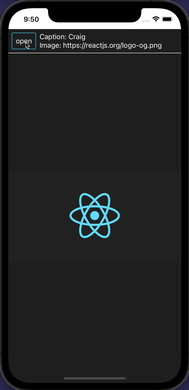

# react-native-thumbnail-selector

[](https://github.com/facebook/react-native)
[](https://www.npmjs.com/package/react-native-thumbnail-selector)
[](https://www.npmjs.com/package/react-native-thumbnail-selector)
[](https://raw.github.com/testshallpass/react-native-thumbnail-selector/master/LICENSE)
[](https://github.com/testshallpass/react-native-thumbnail-selector/actions/workflows/ci.yml)

## Table of contents

- [Installation](#installation)
- [Support](#support)
- [Demo](#demo)
- [Usage](#usage)
- [Props](#props)

## Installation

- `yarn add react-native-thumbnail-selector`
- `npm install react-native-thumbnail-selector --save`

## Support

| react version | react-native version | package version |                     reason                     |
| :-----------: | :------------------: | :-------------: | :--------------------------------------------: |
|    v16.8.0    |       v0.61.0        |     >=3.0.0     | React hooks and usage of `useWindowDimensions` |

## Demo



## Usage

1. Import `import ThumbnailSelector from 'react-native-thumbnail-selector';`
2. Create an array of object(s) that have image and caption properties. Example:

   ```javascript
   const thumbnails = [
     {
       image: 'https://reactnative.dev/docs/assets/favicon.png',
       caption: 'React-native',
     },
     {image: 'https://placeimg.com/125/125/any', caption: 'Any'},
   ];
   ```

3. Add `ThumbnailSelector` component and allocate ref.

   ```javascript
   let thumbnailSelectorRef = useRef();
   <ThumbnailSelector ref={thumbnailSelectorRef} thumbnails={thumbnails} />;
   ```

4. Then to show or hide it use: `thumbnailSelectorRef.current.animate();`.

## Props

| Name                |   Type   | Description                                              | Default                                                                       |
| :------------------ | :------: | -------------------------------------------------------- | ----------------------------------------------------------------------------- |
| `thumbnails`        |  Array   | thumbnails for the Flatlist                              | `[]`                                                                          |
| `renderThumbnail`   | Function | render the thumbnails                                    | undefined                                                                     |
| `onThumbnailSelect` | Function | invoked at thumbnail selection                           | `() => {}`                                                                    |
| `initialIndex`      |  Number  | the index that is selected initially                     | -1                                                                            |
| `horizontal`        | Boolean  | thumbnail stack position                                 | true                                                                          |
| `active`            |  Object  | opacity and border color for thumbnail when selected     | `{ opacity: 1, borderColor: 'black' }`                                        |
| `inactive`          |  Object  | opacity and border color for thumbnail when not selected | `{ opacity: 0.5, borderColor: 'transparent' }`                                |
| `thumbnailProps`    |  Object  | props passed to Image component                          | `{ style: { width: 125, height: 125, borderWidth: 2 } }`                      |
| `captionProps`      |  Object  | props passed to Text component                           | `{style: {fontSize: 16, textAlign: 'center'}}`                                |
| `buttonProps`       |  Object  | props passed to TouchableOpacity component               | `{style: {flexDirection: 'column', padding: 8}}`                              |
| `animatedViewStyle` |  Object  | style for Animated.View                                  | `{ elevation: 1, zIndex: 1,position: 'absolute', top: 0, left: 0, right: 0 }` |
| `animationConfig`   |  Object  | style for Animated.SpringAnimationConfig                 | `{ toValue: 0, duration: 600, friction: 9, useNativeDriver: true }`           |
